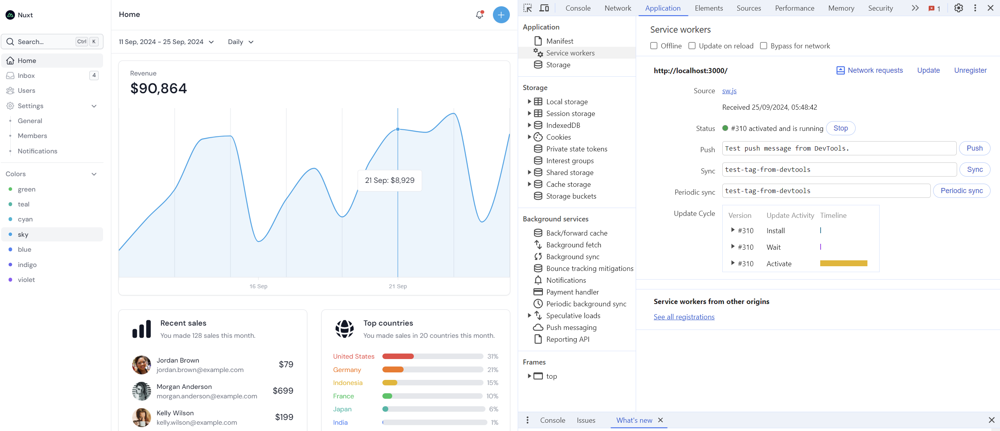
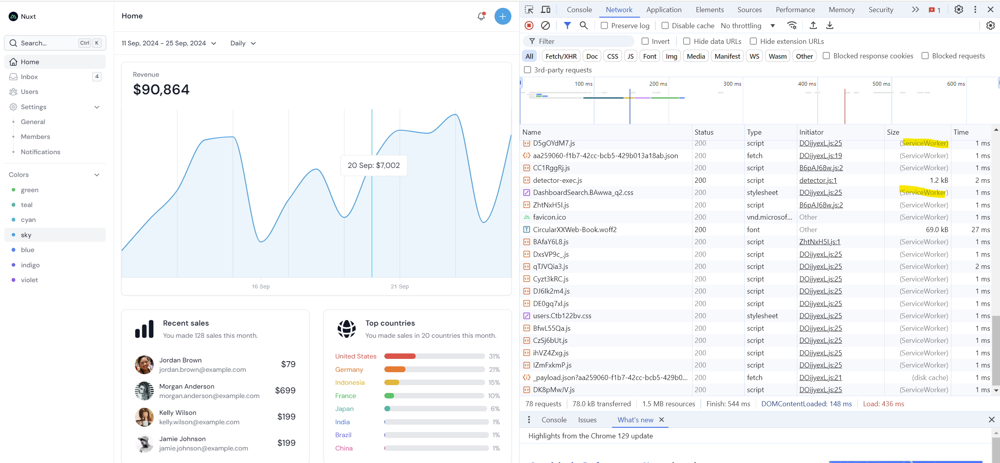

# Local notes about PWA

## Installation

Initial setup
```bash 
npx nuxi init -t github:nuxt-ui-pro/dashboard
```

Running fine with
```bash
npm run dev
```

After license key in -env, running fine with
```bash
npm run build
npm run preview
```

Installing vite-pwa raw
```bash
npx nuxi@latest module add @vite-pwa/nuxtnpx nuxi@latest module add @vite-pwa/nuxt
```

## Configuring PWA

- Added conf for PWA in `nuxt.config.ts`
- Added `favicon.svg` in `app/public`
- Added `pwa-asset-generator` and `pwa-assets.config.js`

## PWA only partially works

PWA partially works. service worker is running and visible in the application tab.

**Problem: The manifest is not shown, so the browser does not show the install popup. The manifest is generated in the output directory, but it is not used for some reason. It is not referenced in `index.html`**

Notes: 
- `npm run build` - works
- `npm run preview` - works
- Developer console does not show a manifest under the Application tab
- Service worker is shown in the Application tab and is running
- There seems to be to main directories in .output which seems like there is some confusion:
  - `.output/public` - contains `index.html` and the generated manifest
  - `.output/app/public` - contains the service worker






# Nuxt UI Pro - Dashboard template

[](https://ui.nuxt.com/pro)

- [Live demo](https://dashboard-template.nuxt.dev/)
- [Play on Stackblitz](https://stackblitz.com/github/nuxt-ui-pro/dashboard)
- [Documentation](https://ui.nuxt.com/pro/getting-started)

## Quick Start

```bash [Terminal]
npx nuxi init -t github:nuxt-ui-pro/dashboard
```

## Setup

Make sure to install the dependencies:

```bash
# npm
npm install

# pnpm
pnpm install

# yarn
yarn install

# bun
bun install
```

## Development Server

Start the development server on `http://localhost:3000`:

```bash
# npm
npm run dev

# pnpm
pnpm run dev

# yarn
yarn dev

# bun
bun run dev
```

## Production

Build the application for production:

```bash
# npm
npm run build

# pnpm
pnpm run build

# yarn
yarn build

# bun
bun run build
```

Locally preview production build:

```bash
# npm
npm run preview

# pnpm
pnpm run preview

# yarn
yarn preview

# bun
bun run preview
```

Check out the [deployment documentation](https://nuxt.com/docs/getting-started/deployment) for more information.

## Renovate integration

Install [Renovate GitHub app](https://github.com/apps/renovate/installations/select_target) on your repository and you are good to go.
